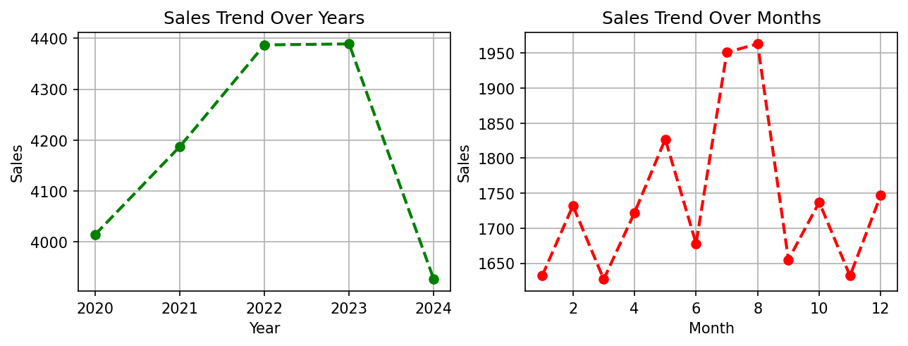
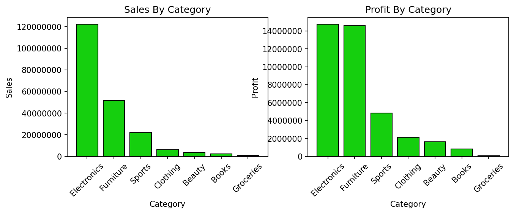
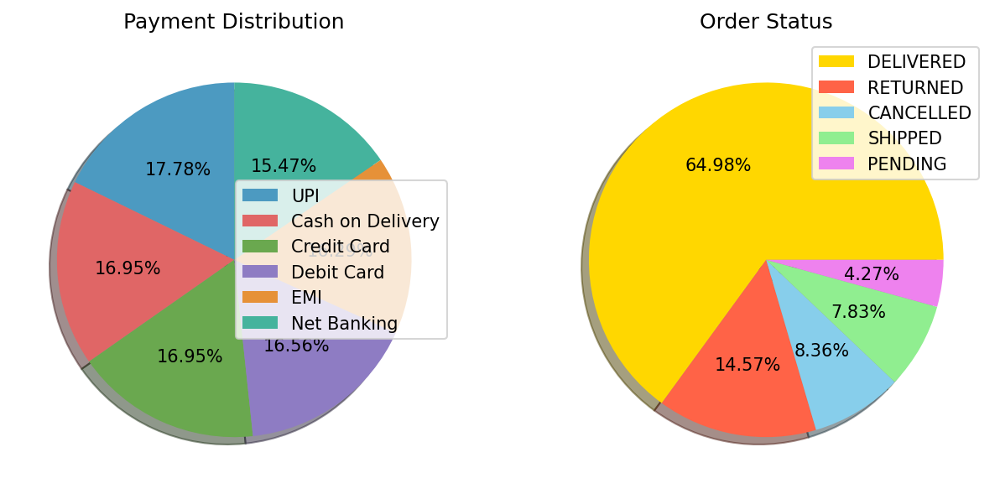

# 📋 Retail Sales Analysis

## About the Project
Retail sales EDA that started with messy data (negative ages, mixed date formats) and ended with real business insights on returns, revenue trends, and customer spend concentration.
What began as a simple analysis turned into a proper lesson in not trusting a dataset just because it looks clean on the surface.

## 🛠️ Tools Used
Python, Pandas, Matplotlib, Seaborn (Jupyter Notebook)

## 🎯 Objective
To extract meaningful insights from the sales dataset — across time, category, region, and customer behavior — and help translate patterns in the data into actionable business decisions.

## 🧹 Data Cleanup
The raw data had negative values, impossible entries (age 0, age 999), inconsistent labels, and mixed date formats — all fixed through a step-by-step validation process before any analysis began.

## 📊 Key Visuals

### Sales Trend Over Years

### Category-wise Sales & Profit

### Payment Method & Order Status

## 📁 Project Structure
Retail_Sales_Project/
├── Retail_Sales_Analysis.ipynb 
├── retail_sales_dataset.csv 
├── images/ 
│ ├── Sales_Trend.png
│ ├── Category_analysis.png
│ └── Payment_Order_analysis.png
└── README.md

## 💡 Key Insights
- Sales *volume* dropped in 2024, but *revenue* rose — average order value increased
- Electronics leads in total sales & profit, but Beauty & Books have the best profit margins
- Electronics has the highest return rate (17.25%) vs. a 14.57% overall average
- Top 10% of customers drive 60.5% of total revenue — driven by what they bought, not repeat loyalty

## ⭐ Support
If you found this project useful or interesting, consider giving it a star — and feel free to share it!
